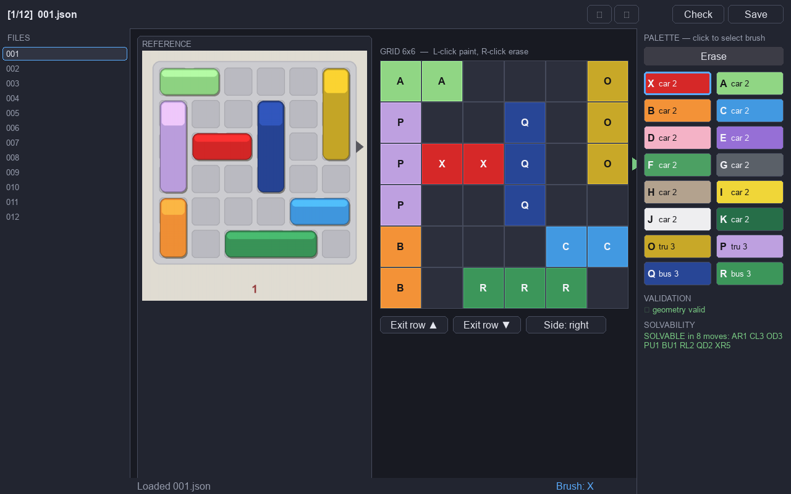

# Traffic Jam

A digital take on the classic **Rush Hour** sliding-block puzzle, rendered in an
isometric "2.5D" perspective with [PyGame](https://www.pygame.org/). Slide the
cars and trucks out of the way and drive the red prime car `X` out the exit.

Vehicles are drawn as colored extruded prisms matching the original game's
colors, lengths, and types (see `reference/vehicles.md`) — light-green Civic,
orange Lamborghini, electric-blue Tesla, semi-trailer trucks, city buses, and so
on.

## Features

- **Isometric 2.5D board** — a 6×6 tray drawn in a 2:1 dimetric projection, with
  depth-sorted vehicle prisms, an exit lane + arrow, and optional letter labels.
- **Natural interaction** — click-and-drag a vehicle along its axis, or single-
  click a piece that has exactly one legal destination to send it there.
- **Undo** (button, `Ctrl+Z`, or `U`), **Reset**, and a **Levels** menu.
- **HUD** — a live move counter, the optimal-solution par, and a **move log** in
  the same notation printed on the cards (`RL2 PU1 CU1 HR1 DD1 …`) that grows
  with each move and shrinks on undo.
- **Win celebration** — the prime car drives out, a fireworks particle system
  fires, then a summary panel shows your move count, the best-possible count, a
  **star rating**, and a **score**.
- **Built-in solver** — a BFS shortest-path solver computes the par for scoring
  and validates every puzzle (and every card import) before it's accepted.
- **Card importer** — a Claude-vision tool that turns photos of the physical
  game cards into solver-validated puzzle data.
- **Level editor** — a point-and-click GUI for fixing imported boards against the
  reference photo; on save it re-solves the board and regenerates the solution,
  with a headless batch mode for validating/cleaning a whole folder.

## Install & run

```bash
pip install -r requirements.txt
python -m trafficjam.main
```

Only `pygame` is needed to play. The `anthropic` and `pillow` packages are used
solely by the card importer.

## How to play

| Action | How |
| --- | --- |
| Move a vehicle | Drag it along its axis (horizontal pieces left/right, vertical up/down) and release to snap |
| Quick-move | Single-click a vehicle that has exactly one reachable position |
| Undo | **Undo** button, `Ctrl+Z`, or `U` |
| Restart level | **Reset** button |
| Pick a level | **Levels** button, or `Esc` |

A move is one vehicle sliding any number of free cells — exactly like the cards,
the move counter ticks up **once per slide** regardless of distance. Win by
sliding the red `X` car off the right-hand exit.

### Scoring

`par` is the true minimum number of moves (from the BFS solver).

- **Score** = `round(1000 × par / your_moves)` — 1000 for an optimal solve.
- **Stars** = 3 if you match par, 2 if within 25% of par, otherwise 1.

## Project layout

```
trafficjam/
  main.py            game loop + state machine (menu → play → win)
  model/             pure logic, no pygame — fully unit-tested
    board.py         Board, Vehicle, legal slides, apply/undo, win check
    moves.py         Move dataclass, card-notation parse/format
    solver.py        BFS shortest solution, reachable positions, validation
  mesh/              generated low-poly vehicle geometry (engine-agnostic)
    geometry.py      Mesh/MeshBuilder, normals, OBJ + glTF export
    cars.py          parametric car generator + archetype presets
  view/              rendering
    iso.py           isometric projection + depth sorting
    render.py        floor tiles, exit, depth-sorted vehicles
    vehicles_draw.py software-3D pass: project / shade / paint the meshes
    hud.py           move counter, undo/reset/levels buttons, move log
    particles.py     fireworks particle system
    summary.py       win panel + score/stars
    menu.py          level select
  controller/
    input.py         mouse: select, axis-constrained drag, click-to-move
  data/
    palette.py       vehicle colors / types / lengths
    puzzles.py       puzzle JSON loader

tools/
  import_cards.py    Claude-vision card importer
  level_editor.py    GUI board editor + headless batch validator/cleaner
  export_meshes.py   export vehicle meshes to OBJ / glTF
  schema.py          puzzle JSON schema + validation

puzzles/             puzzle dataset (JSON) — every entry BFS-verified
needs_review/        imports the solver could not verify (quarantined)
tests/               pytest suite (model, solver, schema, dataset)
reference/           vehicle spec (vehicles.md)
```

## Puzzle format

Each puzzle is a JSON file describing the 6×6 grid, the vehicle placements, the
printed solution, and the solver-computed `min_moves` (the scoring par):

```json
{
  "id": 2,
  "level": "Intermediate",
  "grid": { "rows": 6, "cols": 6, "exit": { "row": 2, "side": "right" } },
  "vehicles": [
    { "id": "X", "row": 2, "col": 1, "len": 2, "orient": "H" },
    { "id": "A", "row": 0, "col": 0, "len": 2, "orient": "V" }
  ],
  "printed_solution": ["XL1", "BD1", "...", "XR6"],
  "min_moves": 13
}
```

Coordinates use `row` 0–5 top→bottom and `col` 0–5 left→right; the exit is on the
right edge at `row 2`. A move token is `<ID><Dir><N>` with `Dir` ∈ `U/D/L/R`.

Every puzzle in `puzzles/` is solver-verified: the printed solution must replay
legally and end with `X` exiting, and `min_moves` must equal the BFS optimum. The
bundled levels `001`–`003` were authored by design and BFS-verified.

## Importing cards from photos

`tools/import_cards.py` builds the dataset from scans/photos of the physical
cards using Claude vision (`claude-opus-4-8`). For each card it reads the **back**
image (the letter-labeled board plus the printed solution) and uses the **front**
image to cross-check colors against the palette, returns strict JSON, then
**validates the result with the BFS solver** before writing it. Anything the
solver can't verify is quarantined to `needs_review/` with the discrepancy noted,
so the dataset only ever contains winnable, correctly-transcribed puzzles.

```bash
export ANTHROPIC_API_KEY=...          # import-time only; never needed to play
pip install anthropic pillow

# Import every rush-hour-<N>-front/back pair found in cards/
python -m tools.import_cards --dir cards --out puzzles --review needs_review

# Dry-run a single card without writing files
python -m tools.import_cards --only 1 --dry-run
```

Name image pairs `rush-hour-<N>-front.jpg` and `rush-hour-<N>-back.jpg`.

## Editing & fixing boards — the level editor

No importer is perfect: a glare, a shadow, or two same-colored pieces can leave a
board mis-read and quarantined in `needs_review/`. `tools/level_editor.py` is a
small PyGame GUI for fixing those boards by hand — paint the correct vehicles
onto the grid while comparing against the original card photo, and it re-solves
and re-validates the result on save.



The window shows, left to right: a **file list** of every `*.json` in the target
directory; the **reference photo** (`<stem>.png` next to the JSON, as written by
the importer); the **editable grid**; and the **palette** of all 16 vehicles —
each swatch in its true color, labeled with its letter code and type/length.
Below the palette, a live **validation** panel (overlaps, bounds, lengths) and a
**solvability** panel show the board's health as you work.

```bash
pip install pygame                                   # already installed to play

python tools/level_editor.py needs_review            # edit a whole directory
python tools/level_editor.py needs_review/009.json   # open one file (folder pre-loaded)
python -m tools.level_editor needs_review            # same, as a module
```

| Action | How |
| --- | --- |
| Select a vehicle brush | Click its swatch in the palette (or **Erase**, or `E`) |
| Paint / erase a cell | **Left-click** paints the active vehicle; **right-click** erases (drag works) |
| Move the exit | **Exit row ▲/▼** and the **Side** button |
| Switch files | Click a file, the **◀ ▶** buttons, or the arrow / `[` `]` keys |
| Check solvability | **Check** button or `V` (runs the BFS solver, never per-frame) |
| Save | **Save** button or `Ctrl/⌘+S` |

**On save** the board is rebuilt from the painted cells and run through the same
BFS solver as the game: if it's solvable, `printed_solution` and `min_moves` are
overwritten with the optimal solution and the stale quarantine note is dropped;
if it's unsolvable the solution is cleared and the save is flagged; if the
geometry is illegal (overlap / out of bounds / wrong length) your edits are kept
but the solution is left untouched until you fix it.

### Headless mode — batch validate & clean

The same logic runs without a GUI to validate and clean files in bulk —
regenerate `printed_solution`/`min_moves`, normalize the vehicle list, and strip
the stale `_validation` quarantine note and the import-time `source` block. It
accepts a single file or a whole directory, rewrites only files whose cleaned
content differs, and **exits non-zero** if any file is unsolvable or has geometry
errors (so it doubles as a CI check):

```bash
python -m tools.level_editor needs_review --headless          # validate + rewrite in place
python -m tools.level_editor needs_review/009.json --headless # one file
python -m tools.level_editor puzzles --dry-run                # report changes, write nothing
```

Each file is reported as `FIXED` / `WOULD` / `OK` / `WARN` / `ERROR` with a
summary line, and geometry-error files are reported but left untouched (a broken
board can't be solved).

## Vehicle meshes

Vehicles are **procedurally generated low-poly meshes** — no images or
third-party geometry. Each is built from a small parameter vector (`CarSpec`: a
side-profile roofline, body width, ride height, glass-cabin range, wheel
placement) by lofting rounded cross-sections along the body and adding wheels as
separate cylinders. Archetype presets (sedan, coupe, wedge, hatch, SUV, pickup,
bus, semi) give silhouettes *evocative of* each vehicle class without copying any
real, branded design; `palette.py` supplies the colors. PyGame renders them with
a small software-3D pass (project → flat-shade → painter's sort) through the same
isometric projection as the board.

The mesh data is engine-agnostic and exports to OBJ and glTF, so the same assets
can drive a future GPU/SceneKit (iOS) port — convert the glTF to Apple's USDZ
with Reality Converter.

```bash
python -m tools.export_meshes --out assets/meshes              # per vehicle (OBJ+glTF)
python -m tools.export_meshes --archetypes --format gltf       # one per archetype
```

To restyle a vehicle, edit its archetype in `trafficjam/mesh/cars.py` (or map a
vehicle id to a different archetype) — the change flows to both the in-game
render and the exported assets.

## Development

Run the test suite (model, solver, schema, and a check that every shipped puzzle
is valid and solvable):

```bash
python -m pytest -q
```
